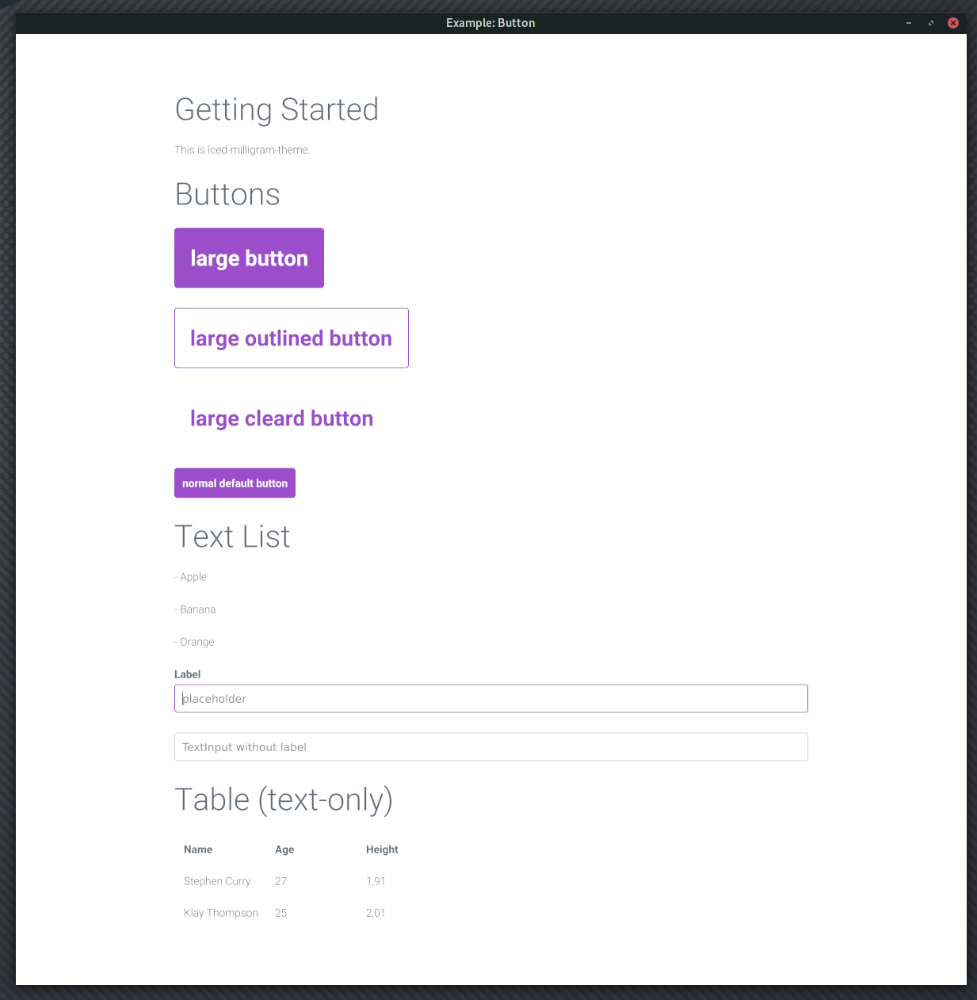

# iced-milligram
A port of a css framework [milligram](https://milligram.io/) to [iced](https://iced.rs/).

```sh
[dependencies]
iced-milligram = { git = "https://github.com/elbaro/iced-milligram", branch = "main" }
```

```rust
let ugly_button = iced::Button::new(iced::Text::new("text"));
let milligram_button = iced_milligram::widget::button("text");
```



This crate does not pixel-perfect replicate the original css framework.
The original milligram theme is adjusted in several ways:

1. The original button has a letter-spacing. `iced` does not support the letter-spacing. Instead a little larger font-size is used.
2. The button color for mouse hover is adjusted. While `iced::button::StyleSheet` can specify a different color for mouse hover, we cannot change the color of the button's children (i.e. the text label).
3. The original paddings / margins are approximated.

## Guide
`iced_milligram::style` has `StyleSheet` types and color/size constants.
`iced_milligram::widget` has constructor functions for common use cases.

```
use iced_milligram::widget as milligram;
let button = milligram::large_outlined_button(&mut state, "Button Label").on_press(..);
let text_input = milligram::text_input(..);
```

## License
- [Roboto Font](LICENSE_ROBOTO)